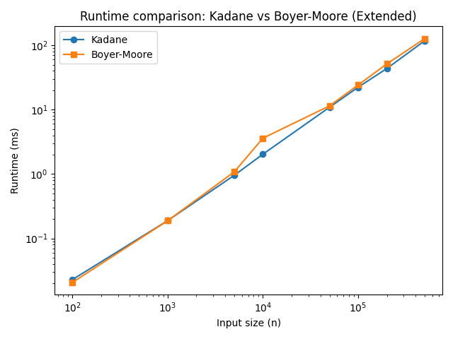
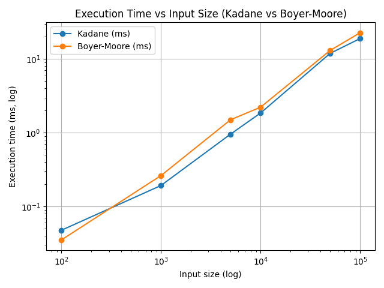

## Kadane’s Algorithm vs Boyer–Moore Majority Vote Algorithm

Kadane’s algorithm: Finds the maximum sum of a contiguous subarray.

Boyer–Moore majority vote algorithm: Finds a majority element in a sequence.

### 1. Algorithm Overview
   #### 1.1 Kadane’s Algorithm

Kadane’s algorithm is designed to solve the maximum subarray problem in linear time. It tracks the maximum sum of a contiguous subarray as it iterates through the array, updating the maximum sum whenever a better one is found.

Time Complexity: O(n)
Space Complexity: O(1)

#### 1.2 Boyer–Moore Majority Vote Algorithm

The Boyer–Moore algorithm is used to find the element that appears more than half the time in a sequence. It maintains a candidate element and a vote counter, updating them as it traverses the array.

Time Complexity: O(n)
Space Complexity: O(1) (Requires a second pass to verify the candidate)

 ### 2. Runtime Comparison

Below is a graph that compares the runtime of Kadane’s algorithm and Boyer-Moore Majority Vote Algorithm as the input size increases.

To give an alternative perspective, the next graph plots runtime on a more granular log–log scale, revealing slight differences in constant factors. Kadane’s algorithm (blue) is consistently a bit faster than Boyer–Moore (orange) for the tested input sizes, though both lines remain straight, confirming linear complexity.

### 3. Comparison Table
| Aspect                   | Kadane’s algorithm                                                                          | Boyer–Moore majority vote                                                                                 |
| ------------------------ | ------------------------------------------------------------------------------------------- | --------------------------------------------------------------------------------------------------------- |
| **Primary use**          | Maximum sum of a contiguous subarray                                                        | Find element occurring more than half the time                                                            |
| **Time complexity**      | `O(n)` – single pass to update running sums                                                 | `O(n)` – two passes: one to select a candidate, one to verify                                             |
| **Space complexity**     | `O(1)` – only a few scalar variables                                                        | `O(1)` – constant number of counters and candidates                                                       |
| **Stability**            | Not applicable (produces a sum, not a permutation)                                          | Not applicable (reports a value, not a permutation)                                                       |
| **Variants**             | Handles all‑negative arrays, circular arrays, 2‑D matrices, and can track start/end indices | Generalises to find elements occurring more than n/k times using k–1 counters (Misra–Gries heavy hitters) |
| **Typical applications** | Financial time series (max profit), signal processing, pattern recognition                  | Mode detection in streaming data, sensor readings, real‑time analytics                                    |

### 4. Summary

Kadane’s Algorithm: Efficient for finding the maximum sum of contiguous subarrays, operating in linear time and constant space.

Boyer-Moore Algorithm: Efficient for detecting a majority element, using a linear scan with constant space. It requires a second pass to verify the majority.

 Differences: Kadane’s algorithm computes a numerical result (the maximum sum) rather than selecting an item, whereas Boyer–Moore selects a value from the input. Kadane finishes in a single pass, whereas Boyer–Moore usually requires a verification pass. Kadane can be extended to multiple dimensions, whereas Boyer–Moore is more specialised but generalises to the Misra–Gries heavy‑hitters problem

Practical advice: Use Kadane’s algorithm for any problem that involves maximising contiguous sums in arrays or matrices, especially when you need efficient O(n) time and minimal memory. Use the Boyer–Moore majority vote when you need to detect a majority (or heavy hitter) in streaming or large datasets where you cannot store all elements in memory.